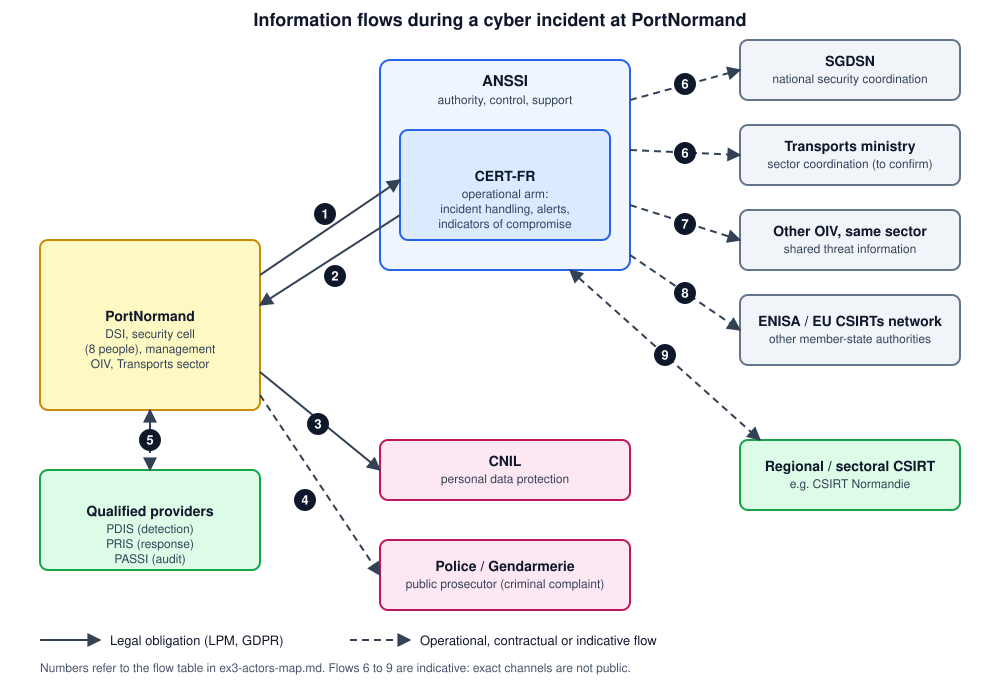

# Exercise 3: Actors Map

**Status:** Done
**Format:** Actor / mission / example table, with a simple information-flow diagram
**Last verified:** 2026-10-01

## 1. Actors table

| Actor | Mission | Example (PortNormand) |
|---|---|---|
| **PortNormand** (DSI, security cell, management) | Operates the vital information systems, applies LPM security rules, declares incidents, keeps a contact point reachable at any time | The security cell detects an intrusion on the terminal SCADA and files the declaration |
| **ANSSI** | National cybersecurity and cyberdefence authority: regulates OIV, controls application of the rules, supports regulated organisations | Sends the NIS2 support letter; may audit PortNormand's vital systems |
| **CERT-FR** (operational arm of ANSSI) | Government and national CSIRT: receives incident declarations, issues alerts and indicators of compromise, assists victims | Receives the incident form and helps analyse the ransomware on the Port Community System |
| **SGDSN** | Parent body of ANSSI; assists the Prime Minister on defence and national security; steers the vital-activity framework (SAIV) | Involved if the incident grows into a national-level crisis |
| **Transports ministry** (sector coordination) | Coordinating ministry for the Transports sector in the vital-activity framework | Follows sector impact of a port stoppage (exact channel to confirm) |
| **CNIL** | Data protection authority; receives personal data breach notifications (72 hours under GDPR, Article 33) | Employee and customer data are exposed in the same incident |
| **Police / Gendarmerie, public prosecutor** | Investigate cybercrime and receive criminal complaints | PortNormand files a complaint after the ransomware attack |
| **Qualified providers** (PDIS, PRIS, PASSI) | ANSSI-qualified detection, incident response and audit services (detailed in Ex.5) | A PRIS provider helps contain and clean the incident |
| **Regional / sectoral CSIRT** (e.g. CSIRT Normandie) | First-level, local incident response, complementary to CERT-FR | Helps smaller subcontractors and partners around the port |
| **Other OIV in the same sector** | Receive shared threat information to strengthen their own defences | Another transport OIV is warned about the same attack technique |
| **ENISA / EU CSIRTs network / other member-state authorities** | European cooperation and information exchange | The acquired logistics subsidiary abroad is also hit |

## 2. Information-flow diagram

| # | From → To | Content | Nature |
|---|---|---|---|
| 1 | PortNormand → CERT-FR | Incident declaration without delay (online or paper form), Defence Code art. L1332-6-2 | **Legal obligation** |
| 2 | CERT-FR → PortNormand | Alerts and technical assistance, sent to the contact point PortNormand must keep reachable at any time | **Legal obligation** (contact point) |
| 3 | PortNormand → CNIL | Personal data breach notification within 72 hours, only if personal data are affected | **Legal obligation** (GDPR) |
| 4 | PortNormand → Police / Gendarmerie / prosecutor | Criminal complaint | Recommended, not an LPM duty |
| 5 | PortNormand ↔ qualified providers | Detection, response, audit services | Contractual |
| 6 | ANSSI → SGDSN, Transports ministry | Situation reporting and crisis coordination | Indicative |
| 7 | ANSSI → other OIV, same sector | Sharing of threat information | Indicative |
| 8 | ANSSI ↔ ENISA, EU CSIRTs network | European cooperation | Indicative |
| 9 | CERT-FR ↔ regional / sectoral CSIRT | Complementary local response | Indicative |

## 3. Key points

- **For an OIV, the entry point is CERT-FR**, not Cybermalveillance.gouv.fr (which serves individuals and small organisations) and not a regional CSIRT.
- **One incident can trigger several parallel notifications** (CERT-FR, CNIL, police). Each has its own deadline and content. This is built on in Ex.4.
- **NIS2 will add a reporting duty** once transposed (see Ex.2). The flow 1 channel and timing may then change.

## 4. Uncertainties

1. **Flows 6 to 9 are indicative.** Public sources describe the roles but not the exact channels or formats.
2. **The role of the Transports ministry and prefects** is based on the bill's impact study (SGDSN, coordinating ministries, defence zones and prefects keep their follow-up role). The practical contact for PortNormand must be confirmed.
3. **Contact details** (CERT-FR address, form URL) are not copied here. Use the official ANSSI "Notifications réglementaires" page and keep them in PortNormand's incident procedure.
4. **Police / Gendarmerie units** are named generically. The competent unit depends on the case.

## Sources

- ANSSI, *Notifications réglementaires*: [cyber.gouv.fr](https://cyber.gouv.fr/contact-acces/contact/notifications-reglementaires/)
- ANSSI, *CSIRT territoriaux* and *dispositif national*: [cyber.gouv.fr](https://cyber.gouv.fr/nous-connaitre/ecosysteme/csirt/csirt-territoriaux/)
- ANSSI, *Missions*: [cyber.gouv.fr](https://cyber.gouv.fr/nous-connaitre/lagence/missions/)
- Haas Avocats, *Incident de sécurité, crise cyber : quelles obligations pour les OIV ?*: [haas-avocats.com](https://www.haas-avocats.com/reglementation/rgpd/incident-de-securite-crise-cyber-quelles-obligations-pour-les-oiv/)
- Impact study of the Résilience bill (Légifrance): [legifrance.gouv.fr](https://www.legifrance.gouv.fr/contenu/Media/files/autour-de-la-loi/legislatif-et-reglementaire/etudes-d-impact-des-lois/ei_art_39_2024/ei_prmd2412608l_cm_15.10.2024.pdf)
