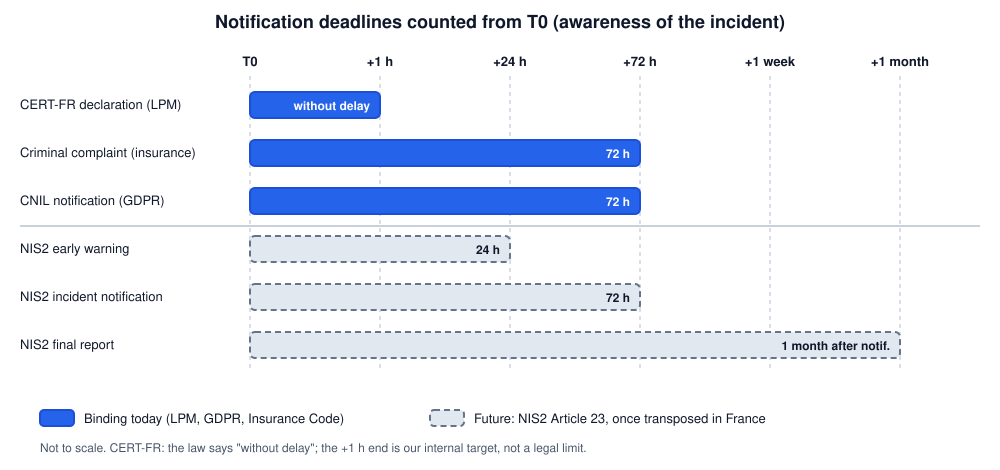

# Exercise 4: Incident Notification Simulation

**Status:** Draft, awaiting team review
**Format:** Chronological timeline (who / what / when) and a 10 to 15 line draft message
**Last verified:** 2026-10-01

## 1. Scenario (fictional)

**Friday, 22:40 (T0).** The security cell receives alerts: files on the **Port Community System (PCS)** servers are being encrypted (ransomware), and the SCADA supervision of an **oil terminal** shows commands that no operator issued, through a remote-access account.

Working assumptions (to confirm with PortNormand):

- The SCADA supervision is a **vital information system (SIIV)**. The PCS may be one too.
- Personal data (staff, shipping customers) may be in the encrypted PCS servers.
- PortNormand holds a cyber insurance policy.
- **T0 = the first qualified alert**, the prudent starting point for every clock.

## 2. Who must be notified, and by when

| Recipient | Basis | Deadline | Applies today? |
|---|---|---|---|
| **CERT-FR** (ANSSI) | Defence Code art. L1332-6-2: any incident affecting the functioning or security of a SIIV | **Without delay** (no fixed number of hours) | **Yes** |
| **CNIL** | GDPR art. 33: personal data breach likely to create a risk | **72 h** from awareness, can be completed later | **Yes**, if personal data are affected |
| **Police / Gendarmerie** (criminal complaint) | Insurance Code art. L12-10-1: compensation depends on a complaint | **72 h** from awareness; a pre-complaint is not enough | **Yes**, to keep insurance cover |
| **Insurer** | Policy terms (assistance line) | As soon as possible, check the contract | Contractual |
| **NIS2 reporting** | Directive (EU) 2022/2555, art. 23 | Early warning **24 h**, notification **72 h**, final report **1 month** after the notification | **Not yet** in France (see Ex.2) |

## 3. Timeline (who / what / when)

| When | Who | What | To / output |
|---|---|---|---|
| **T0** (Fri 22:40) | Security cell analyst | Detects ransomware on the PCS and unusual SCADA commands. **Writes down the exact time.** | Incident log opened |
| T0 + 15 min | Security officer (RSSI) | Declares an incident, wakes the crisis cell, names an incident lead and a scribe | Crisis cell, management |
| T0 + 30 min | IT and OT teams | Isolate IT from OT, put the terminal in degraded or manual mode, **do not reboot or wipe** machines, preserve logs. Safety of people and operations comes first | Containment record |
| **T0 + 1 h** | Incident lead | **Declares the incident to CERT-FR** (online form) with what is known. Gaps are stated, not hidden | **CERT-FR** |
| T0 + 1 h | Management | Informs the insurer's assistance line; warns the data protection officer | Insurer, DPO |
| T0 + 2 h | Incident lead | Engages the incident response provider (PRIS) and, if needed, detection support (PDIS) | Qualified provider |
| T0 + 4 h | DPO, legal | Assess whether personal data are affected; management decides the stance on the ransom note (not the cell alone) | Decision log |
| **T0 + 24 h** | Incident lead | First update to CERT-FR (scope, vector hypothesis, indicators). *Future NIS2: early warning due here* | **CERT-FR** |
| **T0 + 24 to 48 h** | Legal, management | **Files the full criminal complaint** (do not wait for the 72 h limit) | **Police / Gendarmerie** |
| **T0 + 72 h** | DPO | **Notifies the CNIL** if a breach is confirmed or likely; completes later if needed. *Future NIS2: incident notification due here* | **CNIL** |
| T0 + 1 week | Incident lead | Update to CERT-FR; recovery status; lessons started | CERT-FR |
| T0 + 1 month | Security officer | Final report (root cause, measures). *Future NIS2: due one month after the notification* | CERT-FR / ANSSI |

Weekends and nights count: **all clocks keep running** after Friday evening.

## 4. Draft message to CERT-FR (first declaration)

> **Subject: OIV incident declaration, PortNormand, ransomware and suspected SCADA intrusion (preliminary)**
>
> 1. Declarant: [Name, role], PortNormand (OIV, Transports sector). 24/7 contact: [phone / email].
> 2. Declared at [date, time]. Awareness (T0): [date, time].
> 3. Nature: ransomware encryption on Port Community System servers; unauthorised remote commands on the oil terminal SCADA supervision.
> 4. Affected systems: PCS production servers; SCADA supervision of the oil terminal [SIIV status: to confirm].
> 5. Impact: PCS unavailable; terminal in degraded manual mode; no confirmed impact on safety systems [to confirm].
> 6. Suspected vector (hypothesis only): compromised remote-access account.
> 7. Actions taken: IT/OT isolation, credentials reset, logs preserved, crisis cell active, response provider engaged.
> 8. Personal data: exposure under assessment; CNIL notification will follow if confirmed.
> 9. Ransom note received; no contact with the attackers and no payment decision at this stage. Note and indicators attached.
> 10. Assistance requested: technical support, known indicators, advice on the OT environment.
> 11. Other steps: insurer informed; criminal complaint planned within 48 h.
> 12. Next update: [date, time], or earlier on any major change.

French version (what would actually be sent)

> **Objet : Déclaration d'incident OIV, PortNormand, rançongiciel et intrusion SCADA suspectée (préliminaire)**
>
> 1. Déclarant : [Nom, fonction], PortNormand (OIV, secteur Transports). Contact 24/7 : [téléphone / courriel].
> 2. Déclaré le [date, heure]. Prise de connaissance (T0) : [date, heure].
> 3. Nature : chiffrement par rançongiciel des serveurs du Port Community System ; commandes distantes non autorisées sur la supervision SCADA du terminal pétrolier.
> 4. Systèmes touchés : serveurs de production du PCS ; supervision SCADA du terminal pétrolier [statut SIIV : à confirmer].
> 5. Impact : PCS indisponible ; terminal en mode dégradé manuel ; aucun impact avéré sur les systèmes de sûreté [à confirmer].
> 6. Vecteur suspecté (hypothèse) : compte d'accès distant compromis.
> 7. Actions : isolation IT/OT, réinitialisation des identifiants, journaux préservés, cellule de crise active, prestataire de réponse mobilisé.
> 8. Données personnelles : exposition en cours d'évaluation ; notification CNIL à suivre si confirmée.
> 9. Message de rançon reçu ; aucun contact avec les attaquants et aucune décision de paiement à ce stade. Message et indicateurs en pièce jointe.
> 10. Assistance demandée : appui technique, indicateurs connus, conseils sur l'environnement OT.
> 11. Autres démarches : assureur informé ; dépôt de plainte prévu sous 48 h.
> 12. Prochaine mise à jour : [date, heure], ou plus tôt en cas d'évolution majeure.

## 5. Uncertainties

1. **"Without delay" has no fixed hours** for OIV. The +1 h target is our own assumption for the exercise.
2. **When the clock starts.** We use the first qualified alert, the most cautious reading. Legal wording is "awareness", which could be argued differently.
3. **SIIV perimeter.** Only an incident affecting a SIIV triggers the LPM declaration. We assumed the SCADA supervision is one.
4. **NIS2 and LPM together.** Once NIS2 applies, how PortNormand reports one incident under both regimes (one channel or two) is not yet known.
5. **Maritime and port safety authorities.** Other notifications (harbour master, port facility security, vessel traffic) may apply but were **not verified** here. To confirm with PortNormand's security officers.
6. **Insurance.** The 72 h rule conditions compensation under the Insurance Code. Cover itself depends on the policy, which we do not have.
7. **Ransom.** The decision belongs to management with legal advice. Authorities advise against paying. We take no position beyond escalation.

## Sources

- ANSSI, *Notifications réglementaires*: [cyber.gouv.fr](https://cyber.gouv.fr/contact-acces/contact/notifications-reglementaires/)
- NIS2 art. 23 timelines: [Directive (EU) 2022/2555, EUR-Lex](https://eur-lex.europa.eu); summary in [Kertos NIS2 guide](https://www.kertos.io/fr/blog/directive-nis2-guide-2026)
- LOPMI, Insurance Code art. L12-10-1: [Adaltys Avocats](https://adaltys.com/la-lopmi-introduit-le-nouvel-article-l12-10-1-du-code-des-assurances-prevention-des-risques-en-cybercriminalite-et-gestion-de-crise/), [Verspieren](https://www.verspieren.com/fr/entreprise/article/iard/consequences-loi-lopmi-assurance-risques-cyber)
- Cyber incident first steps and ransom advice: [AFUB](https://www.afub.org/cyberattaque-pme)
- GDPR art. 33 (72 h breach notification): [EUR-Lex](https://eur-lex.europa.eu)
